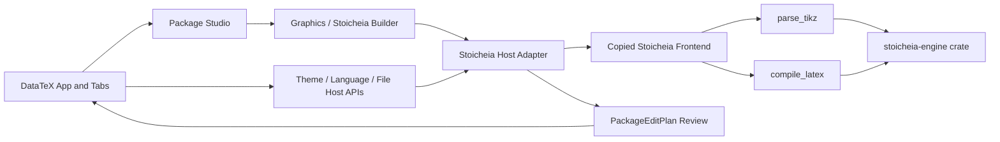

# Stoicheia Copy-First Integration Plan

This document replaces the earlier rewrite-first direction for the initial
Stoicheia migration. The immediate objective is functional and visual parity:
copy the proven Stoicheia implementation into DataTeX with the smallest
possible compatibility layer, verify it, and refactor only after parity has
been demonstrated.

Last updated: 2026-08-03

Planning baseline:

- DataTeX commit: `f6849bd` (`Updated wizards (no tikz)`).
- Stoicheia local version: `1.2.2`.
- Stoicheia remains an ignored reference folder and is not made part of the
  DataTeX source tree.
- The owner has explicitly approved source reuse under the existing DataTeX
  license.
- No implementation change is authorized by this document alone; each phase
  has an independent verification gate.

Current implementation status:

- [x] Created branch `stoicheia-copy-first` from `f6849bd`.
- [x] Re-ran the standalone frontend baseline: 29 test files, 358 tests passed,
      1 skipped.
- [x] Created the copy-first `stoicheia-engine` crate.
- [x] Copied parser, geometry, compiler, and the golden source fixture with
      matching SHA-256 hashes.
- [x] Passed the copied Rust parity gate: 85 passed, 0 failed, 1 ignored.
- [x] Added the Phase 2 Tauri adapter and registered the original
      `parse_tikz` / `compile_latex` command contracts.
- [x] Registered one `graphics-studio` builder without adding a second
      hardcoded frontend list.
- [x] Passed the integrated DataTeX Rust suite: 181 tests, 0 failed.
- [x] Mechanically copied the Phase 3 frontend baseline: 109 source files plus
      one feature-local logo, all recorded in a 110-file SHA-256 manifest.
- [x] Passed all 29 copied frontend test files: 358 passed, 1 skipped.
- [x] Added a second lazy gate whose production chunk is absent from the
      initial DataTeX static import graph.
- [x] Completed the Phase 4 single-window shell gate: scoped CSS, portals,
      cleanup, sanitization, and embedded host ownership.
- [x] Started Phase 5 with a document-scoped session bridge that seeds from the
      active DataTeX tab and atomically resets local graphics state on file or
      Package Studio session changes.
- [x] Enabled reviewed full-document Apply through a SHA-256-validated Rust
      plan, exact stale-source guards, and the existing DataTeX edit flow.
- [x] Added an isolated New Drawing workflow with a Rust-provided scratch
      template and reviewed insertion into the active DataTeX document.
- [x] Completed explicit host-owned Save: embedded File/toolbar/`Ctrl`-`Cmd+S`
      all use review, host Apply, bridge commit, and DataTeX persistence in that
      order, with stale-source and concurrent-write guards.
- [x] Completed host-owned Save As and exact-SVG export without restoring the
      standalone file-system boundary.
- [x] Started Phase 6 by connecting exact previews to DataTeX's existing
      `CompilationManager`, including supersede/unmount cancellation, tracked
      LaTeX/`dvisvgm` stages, tree timeout escalation, and temp cleanup.

Integration audit records:

- [Engine source manifest](../src-tauri/crates/stoicheia-engine/SOURCE_MANIFEST.md)
- [Parser-to-renderer integration contract](../src-tauri/crates/stoicheia-engine/INTEGRATION_CONTRACT.md)
- [Frontend source manifest](../src/features/stoicheia/SOURCE_MANIFEST.md)

## Decision

The first integrated version will be a **copy-first compatibility island**
inside the existing Package Studio:

1. Copy the Stoicheia Rust parser, geometry engine, exact-SVG compiler, frontend
   feature, icons, renderers, dialogs, store, and tests.
2. Preserve their internal relative imports and behavior.
3. Add thin host adapters only at the real application boundaries: Tauri
   commands, active DataTeX document, safe edit review, theme, file lifecycle,
   CSS scope, portals, and Package Studio navigation.
4. Mount it only when the new Graphics/Stoicheia builder is active.
5. Do not create a second Tauri window, browser window, popup application, or
   independent app shell.
6. Do not split the large parser, geometry module, store, canvas, or renderer
   during the parity migration.
7. Refactor incrementally only after copied tests and integration tests pass.

This is deliberately different from building another reduced TikZ wizard from
scratch. The reduced approach costs more time, loses mature behavior, and
produces a UI that differs from Stoicheia.

## Non-negotiable integration rules

- One DataTeX process, one Tauri app, one main window.
- Rust engine first, frontend embedding second.
- DataTeX owns tabs, open/save state, the active document, settings that apply
  to the whole app, and final source writes.
- Stoicheia owns its geometry editing session, instant renderer, source model,
  construction tools, history, selection, and local interaction state.
- Edits remain in the Stoicheia session until the user chooses **Apply**.
- Apply creates a DataTeX `PackageEditPlan` and review/diff; it never silently
  overwrites the editor.
- An apply operation must be rejected if the source revision/fingerprint is
  stale.
- The feature is conditionally mounted, not kept alive with `display: none`.
  An inactive builder must not parse, compile, render, or retain global input
  listeners.
- No broad CSS reset from Stoicheia may escape into DataTeX.
- No source file is refactored merely because it is large during the first
  migration.

## Audit evidence

The targeted architecture audit covered 132 relevant files and approximately
202,684 words. The generated graph contains:

- 929 nodes.
- 1,881 relationships.
- 106 detected communities.
- Core hubs around `parse_any_node()`, `parse_optional_args()`,
  `parse_tikz_code()`, and `resolve_geometry()`.
- Explicitly connected canvas-selection-drag-snapping-preview behavior.
- Explicitly connected parser, normalized geometry scene, fast SVG renderer,
  construction inspector, store, and source-editing behavior.

The local graph artifacts are available in:

```text
Stoicheia project/graphify-out/
├── graph.html
├── graph.json
└── GRAPH_REPORT.md
```

Graph edges inferred only from common names such as `replace()`, `get()`,
`add()`, or `subtract()` are not treated as architecture evidence. The file
classification below is based on actual imports, Tauri commands, source
ownership, runtime behavior, tests, and configuration.

Verified Stoicheia baselines:

- Rust: 86 tests total, 85 passed, 1 ignored benchmark.
- Frontend: 29 test files in the current source tree. The previous full
  Stoicheia verification recorded 358 passing tests and 1 skipped test.
- Frontend source is approximately 31,900 lines.
- `parser.rs` and `geometry.rs` provide 9,525 lines that can remain
  byte-for-byte identical.

## Action vocabulary

Every source group below has one of four actions:

| Action | Meaning |
|---|---|
| **COPY VERBATIM** | Copy to the target path without editing content; preserve a hash in the migration manifest. |
| **COPY + ADAPTER** | Copy first, then make only the listed host-boundary changes. |
| **MERGE** | Do not replace the DataTeX file; add a small, reviewed integration change to it. |
| **OMIT** | Do not bring the file into the DataTeX runtime or repository. |

The default rule is important: when a directory is marked **COPY VERBATIM**,
every matching file is copied unless it appears in a later exception table.

## Target architecture



There is no second application route outside Package Studio. The new builder is
discovered from the existing Rust builder registry and selected through the
existing Package Studio sidebar.

## Target source layout

```text
src/
└── features/
    └── stoicheia/
        ├── App.tsx
        ├── App.css
        ├── components/
        ├── editor/
        ├── geometry/
        ├── hooks/
        ├── i18n/
        ├── icons/
        ├── layout/
        ├── renderers/
        ├── tikz/
        ├── files.ts
        ├── i18n.ts
        ├── performanceMetrics.ts
        ├── store.ts
        ├── theme.ts
        └── bridge/
            ├── StoicheiaPackageStudioAdapter.tsx
            ├── documentBridge.ts
            ├── hostActions.ts
            ├── scopedPortal.ts
            └── types.ts

src-tauri/
├── crates/
│   └── stoicheia-engine/
│       ├── Cargo.toml
│       ├── src/
│       │   ├── lib.rs
│       │   ├── parser.rs
│       │   ├── geometry.rs
│       │   └── compiler.rs
│       └── tests/
│           └── fixtures/
│               └── tkz-triangle.tex
└── src/
    └── package_studio/
        └── stoicheia.rs
```

Keeping the copied frontend directory shape intact preserves almost all current
relative imports. Keeping parser and geometry as sibling modules in their own
crate preserves their cyclic `crate::geometry` / `crate::parser` references.

## Frontend file disposition

### COPY VERBATIM: feature core

Copy these files and directory trees without edits:

```text
Stoicheia project/src/store.ts
Stoicheia project/src/store.test.ts
Stoicheia project/src/files.ts
Stoicheia project/src/files.test.ts
Stoicheia project/src/theme.ts
Stoicheia project/src/theme.test.ts
Stoicheia project/src/performanceMetrics.ts
Stoicheia project/src/editor/**
Stoicheia project/src/geometry/**
Stoicheia project/src/i18n.ts
Stoicheia project/src/i18n/**
Stoicheia project/src/icons/geometry/**
Stoicheia project/src/layout/**
Stoicheia project/src/renderers/**
Stoicheia project/src/tikz/**
```

Why these stay intact:

- `store.ts` contains the complete interaction model, AST variants, history,
  selection, viewport state, command generation, and settings normalization.
- `geometry/**` and `renderers/**` contain the fast local math, viewport
  calculation, culling, and instant SVG renderer.
- `editor/**` uses distinct Monaco IDs (`stoicheia-latex`,
  `stoicheia-dark`, and `stoicheia-light`) and does not replace the DataTeX
  LaTeX grammar.
- `i18n/**` preserves all 14 Stoicheia language modules without immediately
  forcing them into the DataTeX i18next registry.
- Existing localStorage keys are already namespaced with `stoicheia-`.
- `files.ts` and `theme.ts` remain available as standalone-compatible
  implementations, while embedded mode does not call their app-global
  behaviors directly.

### COPY VERBATIM: components

Copy all of:

```text
Stoicheia project/src/components/**
```

including tests, except the files explicitly listed in the following exception
tables. This default rule preserves all other tool dialogs, the object tree,
properties, construction history, inspector, style manager, color control,
command palette, canvas controls, custom toolbar behavior, source editing, and
their regression tests.

### COPY + ADAPTER: app boundary

| Source file | Minimal permitted change |
|---|---|
| `src/App.tsx` | Add embedded host props; use container `ResizeObserver`; replace `w-screen/h-screen` assumptions; put `lang` and `data-theme` on the feature root; use DataTeX source/revision; disable duplicate autosave; expose Back and Apply; reset document-specific state on file change. |
| `src/App.css` | Keep the original source for provenance, but generate/import a deterministic `.stoicheia-scope`-prefixed embedded stylesheet. Do not import its globals directly. |
| `src/components/AppHeader.tsx` | Keep Edit/Insert/View/Styles behavior; redirect New/Open/Save/Save As/Export/Back and `Ctrl+S` through host callbacks; use a feature-local logo import. |
| `src/components/AppHeader.test.tsx` | Keep behavior assertions and replace only the standalone file mocks with host-action mocks. |
| `src/components/Preview.tsx` | Scope the global `H`, `F`, `0`, `+`, `-`, and Space shortcuts to an interaction-focused Stoicheia workspace. |
| `src/components/Preview.test.tsx` | Add the workspace-focus guard to existing tests. |
| `src/components/SettingsPage.tsx` | In embedded mode, delegate app-wide theme, language, and engine settings to DataTeX; keep canvas/editor/export settings local. |
| `src/components/SettingsPage.test.tsx` | Add embedded-host tests without removing standalone tests. |
| `src/components/ToolGroup.tsx` | Constrain fixed tool menus to the nearest embedded scope instead of the browser viewport; observe container resize and retain a standalone document-viewport fallback. |
| `src/components/Toolbar.test.tsx` | Replace the obsolete `100vh` assertion with a container-relative regression. |

### COPY + ADAPTER: embedded lifecycle hooks

| Source file | Minimal permitted change |
|---|---|
| `src/hooks/useAutosaveDraft.ts` | Accept an enabled boundary so embedded mode never starts a second autosave owner. |
| `src/hooks/useAutosaveDraft.test.tsx` | Prove disabled mode neither restores, subscribes, nor writes. |
| `src/hooks/useDocumentPipeline.ts` | Accept host compiler/path overrides and invalidate late frontend parse/compile results on unmount. |
| `src/hooks/useDocumentPipeline.test.tsx` | Prove override forwarding and that late results cannot update the unmounted store. |

`App.tsx` may still use temporary `document.body.style.cursor` and
`userSelect` during active drags, because that is required for smooth pointer
capture. It must restore both values on pointer end and component unmount.

### COPY + ADAPTER: 24 portal dialogs

The JSX and behavior of these components remain unchanged. Only their portal
destination changes from `document.body` to the common
`bridge/scopedPortal.ts` target:

```text
src/components/AdvancedPointDialog.tsx
src/components/AngleValueDialog.tsx
src/components/AssociatedTriangleDialog.tsx
src/components/BarycentricPointDialog.tsx
src/components/CircleCircleDialog.tsx
src/components/CircleTransformationDialog.tsx
src/components/DefinedCircleDialog.tsx
src/components/DefinedLineDialog.tsx
src/components/DefinedTriangleDialog.tsx
src/components/DuplicateSegmentDialog.tsx
src/components/EllipseDialog.tsx
src/components/LineCircleDialog.tsx
src/components/MeasurementDialog.tsx
src/components/PointTransformationDialog.tsx
src/components/PointsTransformationDialog.tsx
src/components/PolygonConstructionDialog.tsx
src/components/ProjectedExcentersDialog.tsx
src/components/RadicalAxisDialog.tsx
src/components/RandomPointDialog.tsx
src/components/ShowLineDialog.tsx
src/components/ShowTransformationDialog.tsx
src/components/TriangleCenterDialog.tsx
src/components/VectorCoordinatesDialog.tsx
src/components/VectorPointDialog.tsx
```

These are React in-window overlays, not operating-system popup windows. The
portal host is created under `document.body` only while the feature is mounted,
has the same `.stoicheia-scope` and theme attributes as the workspace root, and
is removed on unmount.

### CSS isolation decision

Do not use Shadow DOM for the first migration. Although it isolates styles, it
adds avoidable risk to Monaco, clipboard/focus behavior, overflow widgets,
React portals, and the existing window/document event listeners.

Generate a scoped embedded stylesheet instead:

1. Preserve the original `App.css` as copied source.
2. Compile Tailwind and then prefix every resulting selector with
   `.stoicheia-scope`.
3. Map `:root`, `body`, and `#root` to the scope root.
4. Map `:root[data-theme=...]` to
   `.stoicheia-scope[data-theme=...]`.
5. Scope generic `button`, `input`, `select`, `*`, and scrollbar rules.
6. Preserve `@media`, `@supports`, and `@keyframes` correctly.
7. Do not expose Tailwind preflight globally.
8. Run a build-time assertion that no ordinary selector in the generated file
   exists outside `.stoicheia-scope`.

This keeps all component class names untouched and protects the Mantine/DataTeX
shell.

### MERGE: DataTeX frontend surfaces

| DataTeX file | Change |
|---|---|
| `src/components/packages/PackageStudioWorkspace.tsx` | Lazy-import the adapter and render a full-bleed graphics branch. Do not wrap Stoicheia in the normal builder hero/context cards or outer Package Studio scroll area. |
| `src/components/packages/PackageStudioSidebarPanel.tsx` | No hardcoded duplicate card. Continue rendering builders from the Rust registry. Only add host text/icon handling if the generic rendering cannot represent the descriptor. |
| `src/App.tsx` | Reuse existing active path/content and edit-review callbacks. Add only any host callbacks that cannot be expressed through current props, such as export or Save As. |
| `src/services/packageStudioService.ts` | Reuse `PackageEditPlan`, `SourceRange`, UTF-8 byte offsets, and the existing review model. Add bridge types only if necessary; do not move Stoicheia domain types here. |
| `package.json` | Merge dependencies and test scripts; never replace the DataTeX manifest. |
| `pnpm-lock.yaml` | Regenerate through pnpm; do not import npm lock state. |
| `vite.config.ts` | Merge Tailwind/scoped-CSS processing and a lazy Stoicheia chunk into the current DataTeX config. |
| `vitest.config.ts` | Add/merge a DataTeX test setup that can run copied Stoicheia tests. |
| `src/locales/en/translation.json` | Add only DataTeX host controls and stale/apply messages. |
| `src/locales/el/translation.json` | Add the corresponding Greek host strings. |

Do not merge these systems during the parity phase:

- Stoicheia `useEditorStore` with DataTeX tab/settings stores.
- Stoicheia language dictionaries with the global DataTeX i18next registry.
- Stoicheia Monaco language with the general DataTeX LaTeX highlighter.
- Stoicheia CSS with the main DataTeX stylesheet.

They remain an intentionally isolated compatibility layer until the copied
behavior is stable.

### OMIT: frontend files and assets

| Path | Reason |
|---|---|
| `src/main.tsx` | DataTeX already owns the React root. |
| `src/vite-env.d.ts` | DataTeX already has the Vite declarations. |
| `src/.Rhistory` | Local editor/history artifact. |
| `src/assets/react.svg` | Template asset. |
| `src/assets/pgfplots.pdf` | Unreferenced 13 MB third-party manual; link to official documentation or make a separate optional offline pack. |
| `src/assets/tkz-elements.pdf` | Unreferenced third-party manual. |
| `src/assets/tkz-euclide.pdf` | Unreferenced third-party manual. |

`src/setupTests.ts` is copied as test logic but registered through the merged
DataTeX Vitest configuration rather than treated as an application entry point.

## Rust and Tauri file disposition

### COPY VERBATIM: engine core

| Stoicheia source | DataTeX target | Lines | SHA-256 |
|---|---|---:|---|
| `src-tauri/src/parser.rs` | `src-tauri/crates/stoicheia-engine/src/parser.rs` | 6,518 | `707b0d70c95cbd334b94cb1a142c03d52ead1aba64573032ea24ed8dce72a0b7` |
| `src-tauri/src/geometry.rs` | `src-tauri/crates/stoicheia-engine/src/geometry.rs` | 3,007 | `80a808cac88cc05cf56f8dcd5e64cf1c1d29f3cf6ad90989973d22d5f65d06b6` |

Reasons:

- Parser and geometry are platform-neutral Rust.
- They use `nom`, `serde`, the standard library, and each other.
- They do not use filesystem or operating-system APIs.
- Keeping them as sibling modules in a new crate preserves the existing
  `crate::geometry` and `crate::parser::AstNode` imports.
- Their embedded test modules move with them without modification.

The new crate root is a small new file:

```rust
pub mod compiler;
pub mod geometry;
pub mod parser;
```

Do not initially move these files directly under
`src-tauri/src/package_studio/`; that would force unnecessary import changes.

### COPY + ADAPTER: exact SVG compiler

| Stoicheia source | DataTeX target | SHA-256 |
|---|---|---|
| `src-tauri/src/compiler.rs` | `src-tauri/crates/stoicheia-engine/src/compiler.rs` | `db266700bb9cd8797ff04c1cd0817e7519e0c9f3b48a3d41ee3b296ee96ff3d9` |

First copy the compiler byte-for-byte and pass all original tests. Then make
only production-boundary changes.

It must not be discarded as a duplicate of DataTeX's compiler:

| DataTeX compiler | Stoicheia compiler |
|---|---|
| Compiles an existing file. | Accepts source as a string. |
| Produces PDF. | Produces exact SVG. |
| Supports PDF engines, latexmk, bibliography, and SyncTeX. | Produces DVI/XDV and then runs `dvisvgm`. |
| Has process-group cancellation. | Has timeout and `kill_on_drop`, but not complete process-tree cancellation. |
| Has no Stoicheia coordinate anchors. | Injects `ITZ_ORIGIN`, `ITZ_UNIT_X`, and `ITZ_UNIT_Y`. |
| Has no exact-SVG pipeline. | Uses `--exact-bbox` and `--no-fonts`. |

The compiler remains a specialized graphics-preview service. It does not
replace DataTeX's document/PDF compiler.

Required follow-up adaptations before default production enablement:

- Add configurable `dvisvgm` path.
- Reuse DataTeX engine discovery/settings.
- Reuse DataTeX compilation IDs and process-tree termination.
- Replace hardcoded Stoicheia diagnostic branding where appropriate.
- Include the `dvisvgm` executable/version in the cache key.
- Ensure temp cleanup on Windows when child processes still hold files.
- Add single-flight/deduplication for identical concurrent preview requests if
  profiling shows it is needed.

### MERGE: Rust adapter and registry

Create:

```text
src-tauri/src/package_studio/stoicheia.rs
```

Responsibilities:

- Call the copied engine crate.
- Expose the original command names `parse_tikz` and `compile_latex` during the
  parity phase. DataTeX currently has no commands with those names.
- Convert DataTeX engine settings into Stoicheia `LatexEnginePaths`.
- Add revision IDs, diagnostics, logging, cancellation, and future rate
  limiting without changing parser or geometry code.

Merge into existing files:

| DataTeX file | Change |
|---|---|
| `src-tauri/src/package_studio/mod.rs` | Export the thin Stoicheia adapter. |
| `src-tauri/src/package_studio/builders/mod.rs` | Register one `graphics-studio`/`stoicheia` builder descriptor with graphics category and body/full-document targets. |
| `src-tauri/src/lib.rs` | Register only the adapter commands in the existing `tauri::generate_handler!`. |
| `src-tauri/Cargo.toml` | Add the path dependency on `crates/stoicheia-engine`. |
| `src-tauri/Cargo.lock` | Regenerate as the single DataTeX lockfile. |

Do not create another Tauri `Builder`, `run()` function, window, product
identity, or capability set.

### Cargo dependency policy

Create a minimal `src-tauri/crates/stoicheia-engine/Cargo.toml` containing:

```toml
nom = "7.1.3"
serde = { version = "1", features = ["derive"] }
serde_json = "1"
tokio = { version = "1", features = ["process", "fs", "macros", "rt-multi-thread", "time"] }
uuid = { version = "1", features = ["v4"] }
tauri = { version = "2", default-features = false }
```

`tauri = "2"` is initially needed only because the byte-identical engine files
contain `#[tauri::command]`. Removing those attributes and the dependency can be
a later cleanup after parity.

Keep `nom 7.1.3` initially. DataTeX currently sees `nom 8` only transitively;
Cargo can safely contain both versions. A `nom 8` parser migration is a later,
separately tested refactor.

The engine crate does not need:

- `tauri-build`.
- `tauri-plugin-dialog`.
- `tauri-plugin-opener`.
- `staticlib` or `cdylib` outputs.
- Its own executable target.

### MERGE/OMIT: Stoicheia `src-tauri/src/lib.rs`

Do not copy the file. Handle its contents as follows:

| Existing item | Action |
|---|---|
| `mod compiler`, `mod geometry`, `mod parser` | Replaced by the new engine crate root. |
| `greet` | OMIT. |
| `read_text_file` | OMIT from the core and use DataTeX's tab/file lifecycle. |
| `save_text_file` | OMIT from the core and use host actions/safe existing file services. |
| `run()` and its `tauri::Builder` | OMIT. |
| Dialog/opener plugin initialization | OMIT; DataTeX already owns plugins. |
| Unconditional `WEBKIT_DISABLE_DMABUF_RENDERER=1` | OMIT; retain DataTeX's existing diagnostics/compatibility modes. |
| `parse_tikz`, `compile_latex` registration | MERGE through the new adapter only. |

The generic read/write commands accept arbitrary OS paths and would bypass the
host's document lifecycle. They are not required for the embedded feature.

### Fixture handling

`src-tauri/source.tex` and `src-tauri/source (1).tex` are byte-identical:

```text
e677be396d21e45b6cba4541656493064493de612322ab1bbac0cc7b3101c91a
```

Copy one to:

```text
src-tauri/crates/stoicheia-engine/tests/fixtures/tkz-triangle.tex
```

Omit the duplicate. Generated `.aux`, `.dvi`, `.log`, and `.svg` files are never
fixtures.

### OMIT: standalone Rust/Tauri artifacts

```text
Stoicheia project/src-tauri/src/main.rs
Stoicheia project/src-tauri/build.rs
Stoicheia project/src-tauri/tauri.conf.json
Stoicheia project/src-tauri/capabilities/**
Stoicheia project/src-tauri/gen/**
Stoicheia project/src-tauri/icons/**
Stoicheia project/src-tauri/target/**
Stoicheia project/src-tauri/Cargo.lock
```

DataTeX retains its own product name, bundle identifier, PDF asset protocol,
platform icons, capabilities, generated schemas, release configuration, and
single application lockfile.

## Root, build, documentation, and generated file disposition

| Stoicheia path | Action | Destination or reason |
|---|---|---|
| `package.json` | MERGE | Add only missing dependencies and test/budget scripts to DataTeX. |
| `package-lock.json` | OMIT | DataTeX uses pnpm. |
| `vite.config.ts` | MERGE | Add Tailwind/scoped CSS and lazy chunk logic without replacing existing chunks. |
| `vitest.config.ts` | MERGE | Create/merge DataTeX Vitest support. |
| `tsconfig.json` | OMIT | Existing DataTeX TypeScript config is compatible. |
| `tsconfig.node.json` | OMIT | Existing build setup owns Node/Vite types. |
| `index.html` | OMIT | Standalone entry document. |
| `README.md` | OMIT from runtime | Use as provenance/reference only; it describes standalone install/release. |
| `public/stoicheia-logo.svg` | COPY + ADAPTER | Copy as a feature-local asset only if the embedded header retains branding. |
| `public/tauri.svg` | OMIT | Template asset. |
| `public/vite.svg` | OMIT | Template asset. |
| `scripts/check-bundle-budget.mjs` | COPY + ADAPTER | Convert from whole-app budgets to a graphics lazy-chunk budget. |
| `docs/geogebra-like-canvas-plan.md` | COPY VERBATIM as reference | Optional `docs/stoicheia-reference/`; valuable behavior roadmap. |
| `docs/performance-audit.md` | COPY VERBATIM as reference | Preserve performance rationale and benchmark expectations. |
| `docs/i18n-audit.md` | COPY VERBATIM as reference | Preserve translation coverage/gaps. |
| `docs/toolbar-icon-audit.md` | COPY VERBATIM as reference | Preserve icon-system decisions. |
| `docs/multi-file-editor-plan.md` | OMIT from active roadmap | DataTeX already owns a richer tab/document lifecycle; retain only in the ignored source folder. |
| `docs/images/stoicheia-workspace.svg` | COPY as optional reference | Useful design baseline, not a runtime asset. |
| `docs/images/pasted file.png` | OMIT from runtime | Screenshot reference remains in ignored source. |
| `refactor_preview.py` | OMIT | One-off incomplete refactor script. |
| `patch_preview.py` | OMIT | One-off patch script. |
| `test_svg.py` | OMIT | Debug script, not a maintained test. |
| `test_parse.js` | OMIT | Debug script, not a maintained test. |
| `test.tex` | OMIT | Ad-hoc root sample; use curated fixture instead. |
| `test.aux`, `test.dvi`, `test.log`, `test.svg` | OMIT | Generated output. |
| `scratch/**` | OMIT | Temporary exact-preview artifacts; only curated source may become a fixture. |
| `dist/**` | OMIT | Generated web bundle. |
| `node_modules/**` | OMIT | Dependency cache. |
| `graphify-out/**` | OMIT from DataTeX runtime | Local audit output only. |

## Frontend dependencies

Already compatible:

- React and React DOM `19.1`.
- `@monaco-editor/react` `4.7`.
- Tauri API and dialog plugin `2.x`.
- Zustand `5.x`.

Add through pnpm:

- `lucide-react`.
- `tailwindcss`.
- `@tailwindcss/vite`.
- `vitest`.
- `@testing-library/react`.
- `@testing-library/jest-dom`.
- `jsdom`.

DataTeX currently uses Zustand `5.0.9` and Stoicheia declares `5.0.14`.
Do not upgrade solely for the migration. First run the copied tests against the
DataTeX version; upgrade only if a test or API incompatibility proves it
necessary.

Vite must preserve DataTeX's current build configuration while adding:

- Tailwind processing used only by the copied feature stylesheet.
- A dedicated lazy Stoicheia chunk.
- Separate lazy locale and icon chunks where useful.
- No eager import from the app shell or sidebar.

## Package Studio UI integration

### Builder registration

Add one Rust registry descriptor, not multiple placeholder buttons:

- ID: `graphics-studio` or `stoicheia`.
- Display name: `Graphics Studio`.
- Category: `graphics`.
- Packages: initially `tikz`, `tkz-euclide`; future adapters may add PGFPlots,
  tkz-elements, and PSTricks without duplicating the workbench.
- Output targets: `body` and `fullDocument`.
- Support: native editable.
- Preview: instant and exact compile.
- Import: active-document/block import.

The existing sidebar reads the Rust registry, so no second hardcoded builder
list is required.

### Full-bleed workspace

The Stoicheia workbench needs the central Package Studio area. When its builder
is active:

- Skip the normal Package Builder hero.
- Skip the compact document-context card.
- Skip the normal outer builder scroll panel.
- Give Stoicheia `width: 100%`, `height: 100%`, and `min-height: 0`.
- Keep the existing Package Studio header/back navigation.
- Render the copied Stoicheia header in embedded mode, with app/file commands
  delegated to DataTeX.

This preserves the three-pane editor/canvas/inspector layout without opening a
new window or squeezing it beside the main editor.

## Active document and edit bridge

### Session start

Before Package Studio opens, DataTeX already calls
`syncActiveEditorContent()` and passes `activeFilePath` and
`activeFileContent`. The adapter must additionally capture:

- Active tab ID/path.
- Original source.
- A monotonically increasing revision or SHA-256 fingerprint.
- Optional selected/current `tikzpicture` UTF-8 byte range.
- DataTeX theme, language, and TeX engine paths.

The initial implementation may import the full document. Block-level import is
enabled once range detection has its own tests.

### Local editing

- Seed the copied Stoicheia store once per active document/session.
- Keep all intermediate construction changes local.
- Do not update the hidden DataTeX editor on every drag or keypress.
- Parse after the copied 50 ms debounce.
- Run exact LaTeX/SVG compilation only in exact-preview mode after the copied
  1,500 ms debounce.
- Store a session key based on active tab/path so document A never inherits
  nodes, history, selection, diagnostics, or compiled SVG from document B.

### Apply

1. Generate the final Stoicheia source.
2. Compare the captured revision/fingerprint with the current DataTeX source.
3. If stale, stop and offer reload/rebase; do not overwrite.
4. Create a `PackageEditPlan`:
   - Replace the exact UTF-8 byte range for an imported `tikzpicture`; or
   - Replace the full source only when the user explicitly opened full-document
     mode; or
   - Insert a new generated block through the existing insertion flow.
5. Show the existing DataTeX review/diff.
6. Apply only after user confirmation.
7. Update the Stoicheia baseline to the applied revision.

This reuses the existing `SourceRange`, UTF-8 byte conversion, edit sorting, and
review UI instead of inventing a second write path.

### File actions

In embedded mode:

- New/Open act through DataTeX tabs.
- Save/`Ctrl+S` invokes one DataTeX host action only.
- Save As acts through DataTeX.
- Export SVG can use the existing Tauri dialog/FS capability through a narrow
  host callback.
- Stoicheia recent-files and autosave implementations stay available for
  standalone compatibility but are not a second source of truth.

## Theme, language, settings, and input ownership

- Apply DataTeX theme to `.stoicheia-scope` and the scoped portal root, never to
  `document.documentElement` from embedded mode.
- Set `lang`/`dir` on the Stoicheia feature root.
- Use the DataTeX language when Stoicheia supports it; otherwise fall back to
  Stoicheia English without changing the entire app language.
- DataTeX owns compiler executable paths and app-wide appearance.
- Stoicheia keeps canvas-specific preferences, default zoom, snapping,
  visibility, and export defaults.
- Register global keyboard listeners only while the feature is mounted.
- Guard canvas-only shortcuts by workspace interaction focus.
- Remove listeners, RAF callbacks, timers, resize observers, cursor overrides,
  and portal roots on unmount.

## Rust-first implementation phases

### Phase 0 — Freeze provenance and parity baseline

- [x] Record DataTeX commit and the Phase 1 Stoicheia source manifest.
- [x] Record SHA-256 for every file copied in Phase 1.
- [x] Confirm ownership/license note in this document and the engine manifest.
- [x] Run original/copied Rust tests and record `85 passed / 1 ignored`.
- [x] Run original frontend suite and record `358 passed / 1 skipped`.
- [ ] Save golden parser, geometry, instant-SVG, exact-SVG, and generated-source
      fixtures.
- [ ] Record bundle size and representative parse/render/drag timings.

Gate: no source copied until baseline results and hashes are reproducible.

Rollback: documentation-only; no runtime change.

### Phase 1 — Mechanical Rust engine transplant

- [x] Create `src-tauri/crates/stoicheia-engine`.
- [x] Copy `parser.rs`, `geometry.rs`, and `compiler.rs` byte-for-byte.
- [x] Add the minimal crate root and manifest.
- [x] Copy one curated `.tex` fixture.
- [x] Verify the three source hashes.
- [x] Run the new crate tests before any adapter change.

Gate: exactly 85 Rust tests pass and the benchmark remains ignored.

Rollback: remove the unreferenced path crate; DataTeX behavior is untouched.

### Phase 2 — Thin Tauri and builder adapter

- [x] Add `package_studio/stoicheia.rs`.
- [x] Preserve `parse_tikz` and `compile_latex` command names.
- [x] Register commands in the existing DataTeX handler.
- [x] Add one graphics builder to the Rust registry.
- [x] Preserve the standalone engine-path mapping and diagnostic payloads.
- [x] Confirm no second app builder/window/config/capability is introduced.

Gate: command contract tests return the same serialized parser and compiler
payloads as standalone Stoicheia.

Verified on 2026-07-29:

- Five focused adapter contract tests pass.
- The adapter returns the engine's original parser/compiler output types
  directly; its only input mapping is the host-owned engine-path DTO.
- `LatexEnginePaths` retains the standalone `lualatex`, `pdflatex`, and
  `xelatex` fields and accepts the DataTeX `lualatexPath`, `pdflatexPath`, and
  `xelatexPath` aliases at the host boundary.
- Parser payloads preserve `geometry_complete`, `renderScene`, diagnostics, and
  timing field names; compiler errors and `error_log` remain unchanged.
- The full DataTeX library suite passes with 169 tests.
- `cargo check --all-targets --offline` passes.
- The existing Package Studio frontend integration suite passes with 15 tests.
- The root `src-tauri/Cargo.lock` contains the local `stoicheia-engine` path
  package and the copied engine remains the only Stoicheia Rust runtime.

Rollback: unregister commands and the builder; copied engine remains dormant.

### Phase 3 — Mechanical frontend transplant

- [x] Copy the approved frontend trees with their directory shape intact.
- [x] Install the runtime and test dependencies needed before CSS integration
      through pnpm.
- [x] Add Vitest support and run copied tests before host adaptation.
- [x] Create a lazy import boundary; verify no Stoicheia chunk loads at normal
      DataTeX startup.
- [x] Preserve original component behavior and internal store ownership.

Gate: all copied tests that do not exercise a host boundary pass unchanged.

Verified on 2026-07-28:

- 109 TypeScript/TSX/CSS files and one logo were copied without source edits.
- All 110 copied-file hashes pass `sha256sum -c`.
- The 29 original frontend test files pass with 358 tests and 1 skipped.
- The additional lazy-boundary test passes, for a total of 30 test files,
  359 passed, and 1 skipped.
- The Package Studio integration suite passes with 16 tests.
- `pnpm run build` passes without importing raw Stoicheia CSS.
- Vite emits the Stoicheia App as a dynamic 792,794-byte minified chunk.
- The build manifest proves that chunk is reachable only through the already
  lazy Package Studio workspace and is absent from `index.html`, initial
  modulepreloads, and the entry's static import closure.
- Stoicheia's Editor, Settings, Command Palette, and construction dialogs
  retain separate dynamic chunks.
- The DataTeX Rust regression suite still passes with 169 tests.
- Tailwind installation and stylesheet processing remain deliberately deferred
  to Phase 4, where selectors will be scoped before the CSS is imported.

Rollback: remove the unmounted feature directory and dependency additions.

### Phase 4 — CSS, portal, and embedded shell boundary

- [x] Generate the deterministic scoped stylesheet.
- [x] Add the shared scoped portal root.
- [x] Change only the 24 portal destinations.
- [x] Add embedded props to `App.tsx` and `AppHeader.tsx`.
- [x] Use container measurements instead of viewport assumptions.
- [x] Scope theme, language, and global shortcuts.
- [x] Render the feature full-bleed in Package Studio.

Gate:

- No selector leaks outside `.stoicheia-scope`.
- Monaco, dialogs, clipboard, keyboard navigation, focus, resize, and pointer
  dragging work in the single DataTeX window.
- Unmount leaves no frontend listener, timer, portal, body cursor, late state
  commit, or newly scheduled parse. Cancellation of a native compile process
  that was already spawned remains the explicit Phase 6 process-tree task.

Verified on 2026-07-29:

- Tailwind is compiled only from the Stoicheia candidate tree and transformed
  into a deterministic lazy stylesheet. All selectors, Tailwind custom
  properties, cascade layers, and keyframes are Stoicheia-namespaced.
- The current generated output contains 802 scoped rules, 52 namespaced
  Tailwind custom properties, five namespaced cascade layers, two keyframe
  steps, and zero selector, root-anchor, or global-namespace leaks.
- All 24 copied dialogs use one adapter-owned portal. It is mounted above the
  workbench title bar, traps keyboard focus, restores the invoking control,
  inherits host theme/language, and is removed on unmount.
- Embedded mode synchronizes host theme, language, compiler, and engine paths
  before paint without changing DataTeX's document root, and restores
  Stoicheia's standalone-owned settings when unmounted.
- Independent file actions, autosave, theme/language controls, and native TeX
  settings are disabled or delegated. Save and Apply intentionally remain
  unwired until the reviewed document bridge in Phase 5.
- The nested code-editor boundary initializes DataTeX's bundled Monaco before
  exposing the copied editor component. Opening Graphics Studio first therefore
  cannot fall back to the online AMD loader or request its absent
  `loader.js.map`, while the shell and instant canvas can mount without waiting
  for the editor bundle.
- The shared Monaco runtime installs Vite's `getWorker` factory before either
  DataTeX or Stoicheia imports the editor. Editor, JSON, CSS, HTML, and
  TypeScript services are emitted as separate worker assets; both custom LaTeX
  language IDs use the editor worker and no longer fall back to the UI thread.
- Main/editor/inspector and floating tool-menu geometry now use their nearest
  workbench container. Resize and canvas drag state restores on pointer end,
  cancellation, window blur, and unmount.
- Exact compiled SVG is allowlist-sanitized before DOM insertion while
  preserving the validated `ITZ_ORIGIN`, `ITZ_UNIT_X`, and `ITZ_UNIT_Y`
  coordinate-anchor metadata required by the overlay transform.
- A feature-local error boundary offers Retry and Back instead of allowing a
  copied component failure to unmount the DataTeX root.
- `pnpm run check:stoicheia:copy` verifies the per-file patch ledger, all 24
  portal targets, 39 explicit adapters, and 71 still-byte-identical baseline
  files. The check is also part of `prebuild`.
- The complete Stoicheia frontend suite passes in DataTeX with 45 test files,
  429 passed tests, and one intentionally skipped benchmark. Package Studio's
  integration suite passes all 22 tests.
- The copied Rust engine passes 85 tests with one ignored benchmark, and the
  DataTeX Rust library suite passes all 209 tests.
- Production build and the lazy-manifest gate pass. The adapter is 811,597
  bytes against a 921,600-byte cap, its scoped CSS is 113,828 bytes against a
  131,072-byte cap, and all 28 Stoicheia JS chunks total 975,284 bytes against
  a 1,228,800-byte cap. No Stoicheia entry appears in the initial static graph.
- The generated source stylesheet is 134,640 bytes with SHA-256
  `a424e96d2af3f50c74d526357ea698475c3f2391f60709f2349e5638a7006841`.

Rollback: disable the builder; other Package Studio builders remain unchanged.

### Phase 5 — DataTeX document bridge

- [x] Seed the session from the active DataTeX tab.
- [x] Reset document-local state on active-file change.
- [x] Redirect Save and `Ctrl`/`Cmd+S` to the reviewed host action.
- [x] Add host-owned Save As and SVG export; embedded New/Open remain DataTeX
      shell actions rather than copied standalone file actions.
- [x] Disable duplicate embedded autosave.
- [x] Implement source revision/fingerprint validation.
- [x] Create reviewed full-document edit plans.
- [x] Create selected/current `tikzpicture` edit plans.
- [x] Create new-drawing scratch sessions and reviewed insertion plans.
- [x] Reuse the existing DataTeX diff/apply flow.

Gate: no direct overwrite path exists; stale edits are rejected; switching
files cannot leak source, nodes, history, selection, diagnostics, or preview.

Rollback: keep the workbench read-only/preview-only until the bridge is fixed.

Phase 5 slice 1 verification:

- The active file path and source cross the lazy boundary only when Graphics
  Studio is mounted; a literal empty source remains valid.
- One Package Studio lifetime owns one session token. Switching builders within
  that lifetime preserves an unapplied local draft, while closing and reopening
  Package Studio reloads the latest DataTeX source even for the same path.
- File changes atomically clear source undo/redo, parsed/resolved geometry,
  exact preview, compile state, diagnostics, selection, active tool, and camera
  state while preserving user/workbench settings.
- The embedded App is unmounted across an identity change, so component-local
  dialogs, Monaco state, pointer listeners, animation frames, and late pipeline
  results cannot leak into the next document.
- Eight bridge/adapter regressions pass, including empty-safe hydration,
  same-session draft retention, same-path reopen, Windows paths, file switching,
  and no-active-document cleanup.

Phase 5 slice 2 verification:

- Apply captures a frozen payload containing session/document identity, exact
  immutable baseline, local replacement source, and diagnostic revision.
- A Rust planner validates the request schema, document/path identity, and a
  SHA-256 of the UTF-8 baseline before returning one full-document `TextEdit`;
  it never writes a file.
- Rust source positions now use Monaco-compatible UTF-16 columns, including
  non-BMP characters such as emoji.
- The host binds review to the original target tab/path and exact-compares its
  source both before opening review and immediately before Apply.
- A slow planner result is ignored after builder, file, session, or workspace
  changes.
- The shared diff/review surface is rendered inside the Graphics Studio window
  with focused changed-line context; there is no popup or direct overwrite.
- Only a confirmed host Apply advances the Stoicheia baseline. Discarded,
  closed-target, or stale plans cannot advance it.
- Embedded Save remains intentionally unwired until review-then-save semantics
  replace the current stale-Monaco-prone host save path.
- Verification passes: 9 new Rust planner regressions, all 181 DataTeX Rust
  tests, 402 frontend tests with 1 skipped, all 18 Package Studio contract
  checks, production build, and the lazy budget gate. The lazy adapter is
  807,469/921,600 bytes and all 28 Stoicheia JS chunks total
  971,156/1,228,800 bytes.

Phase 5 slice 3 verification:

- DataTeX captures the exact Monaco cursor and selection from the same source
  snapshot that is passed to Package Studio, converting UTF-16 string offsets
  to UTF-8 byte offsets before Rust target resolution.
- Rust discovers real `tikzpicture` environments while ignoring comments and
  escaped markers, rejects malformed/nested structures, and returns canonical
  target ordinals, SHA-256 identities, UTF-8 ranges, Monaco positions, labels,
  and previews.
- A focused working source retains the document shell and selected environment
  byte-for-byte while removing every other real `tikzpicture`. The copied
  Stoicheia first-environment tools therefore edit the requested drawing
  instead of silently mutating figure 1.
- One target is selected automatically; multiple targets use the captured
  cursor/selection when unambiguous and otherwise stop behind an in-window
  figure selector. Whole-document mode is explicit and visibly marked as an
  advanced path.
- Rust accepts either the deterministic focused source or a byte-identical
  full-source shell and returns at most one edit for the selected environment.
  Every byte in the full DataTeX document outside that range is preserved.
- Apply now validates the immutable session non-mutatingly before DataTeX
  changes the editor, then commits the actual full applied source only after
  the reviewed host edit succeeds. Target/file switches invalidate pending
  planners and reviews.
- Target changes use an inline discard confirmation, never a popup. The
  selected target, line range, and `Range-safe` status remain visible above the
  workbench.
- Verification passes: 14 new Rust range regressions and all 195 Rust library
  tests; 409 frontend tests with 1 skipped; 19 Package Studio contract tests;
  TypeScript type-check, production build, copy-baseline gate, diff hygiene,
  and the lazy budget gate. The adapter is 807,914/921,600 bytes, scoped CSS is
  113,282/131,072 bytes, and all 28 Stoicheia JS chunks total
  971,601/1,228,800 bytes.

Phase 5 slice 4 verification:

- New Drawing starts from one deterministic, compile-ready Rust template with
  exactly one empty `tikzpicture`; each draft receives a fresh session identity
  so discarded state cannot reappear in a later drawing.
- The destination remains the immutable full DataTeX baseline while Stoicheia
  edits only the isolated scratch source. An open target tab is required, but a
  literally empty target file is valid and is expanded into a complete LaTeX
  document by Rust.
- The in-window setup offers a captured non-empty selection, a safe body cursor,
  or insertion before `\end{document}`, plus inline or `figure` wrapping with
  placement, centering, caption, and label controls.
- Rust extracts the sole real drawing, validates the destination and wrapper,
  derives and deduplicates package/library requirements, and returns minimal,
  non-overlapping preamble/body edits. Comments, CRLF, Unicode/UTF-16 positions,
  malformed/nested drawings, partial overlaps, and stale hashes have dedicated
  regressions.
- Every insertion uses DataTeX's existing diff/review/apply path. Changing any
  insertion option invalidates a pending review, and a successful commit closes
  the scratch session before rediscovery so the same drawing cannot be inserted
  twice accidentally.
- Verification passes: all 209 Rust library tests; 412 frontend tests with 1
  skipped; all 20 Package Studio contract tests; TypeScript type-check,
  production build, copy-baseline gate, diff hygiene, and the lazy budget gate.
  The adapter is 807,974/921,600 bytes, scoped CSS is 113,282/131,072 bytes,
  and all 28 Stoicheia JS chunks total 971,661/1,228,800 bytes.

Phase 5 slice 5 verification:

- Embedded File Save, the compact Save toolbar action, scoped `Ctrl+S` and
  `Cmd+S`, plus DataTeX's global Save action all enter one host-owned callback.
  Embedded `Ctrl`/`Cmd+Shift+S` is suppressed until a real host Save As
  contract exists; standalone file APIs are never called.
- Save freezes the exact local draft and reuses the same Rust full-document,
  selected-`tikzpicture`, or New Drawing planner. The user must accept the
  in-window review before host Apply; the bridge commits only after Apply, and
  DataTeX writes only after that commit succeeds.
- Lifecycle validation covers both immutable session identity and the exact
  current Stoicheia draft. Editing, changing target/file, dismissing review, or
  receiving a stale asynchronous planner result invalidates the request.
- DataTeX validates exact document ID, path, and committed full source. Monaco
  snapshots are document-keyed, newer editor changes remain dirty after an
  older write, and writes are serialized per path so completion order cannot
  overwrite a newer explicit Save.
- Concurrent saves to different paths remain independent; loading/error state
  cannot leak from an old target. A closed or renamed target cannot produce a
  false green acknowledgement after its write completes.
- Verification passes: all 209 Rust library tests; 416 frontend tests with 1
  skipped; all 21 Package Studio contract tests; TypeScript type-check,
  production/lazy build, copy-baseline and scoped-CSS gates, and diff hygiene.
  The lazy adapter is 809,066/921,600 bytes, scoped CSS is
  113,282/131,072 bytes, and all 28 Stoicheia JS chunks total
  972,753/1,228,800 bytes.

Phase 5 slice 6 verification:

- Embedded File Save As, scoped `Ctrl`/`Cmd+Shift+S`, and DataTeX's global Save
  As action now enter one host-owned destination picker. Cancellation mutates
  nothing; the selected destination is frozen before the Rust edit plan and
  remains attached to the exact pending review.
- Save As follows `validate → review → host Apply → bridge commit → host write`.
  DataTeX rejects stale source/path identities, `.dtex` raw writes, normalized
  open-tab collisions, and concurrent destination changes. A successful write
  retargets the same editor tab atomically only when its source and destination
  identities are still exact.
- The post-commit lifecycle separately validates the current local Graphics
  draft. If a newer draft or tab change appears during the write, the new file
  is retained as an explicit saved copy while the original tab/session remains
  open and unchanged; no newer work is discarded by a late retarget.
- Embedded File Export SVG and scoped `Ctrl`/`Cmd+Shift+E` are enabled only for
  a fresh exact render (`compiledSource === source` and no compile in flight).
  The bridge freezes the raw render revision, allowlist-sanitizes the SVG, and
  applies a 25 MiB pre-sanitization ceiling before the payload reaches DataTeX.
- DataTeX alone chooses and writes the SVG destination. It revalidates the
  session, target, source, compiled SVG revision, and open document after the
  native dialog and again inside the per-path write queue. The copied
  standalone file/SVG APIs remain outside the embedded path.
- Verification passes: all 209 Rust library tests; 429 frontend tests with 1
  skipped; 53 focused bridge/header/store tests; all 22 Package Studio contract
  tests; TypeScript type-check, copy-baseline, scoped-CSS, production/lazy
  build, and diff hygiene. The lazy adapter is 811,597/921,600 bytes, scoped CSS
  is 113,828/131,072 bytes, and all 28 Stoicheia JS chunks total
  975,284/1,228,800 bytes.

### Phase 6 — Production compiler hardening

- [x] Connect exact-SVG jobs to DataTeX process-tree cancellation.
- [x] Add configurable/discovered `dvisvgm`.
- [x] Make cache identity include compiler and `dvisvgm` details.
- [x] Add native Windows, Linux, Intel Mac, and Apple Silicon smoke tests.
- [ ] Verify timeout and temp cleanup.
- [x] Keep instant preview responsive while exact preview runs.

Phase 6 slice 1 is complete:

- Every real exact render receives a unique `compilationId`; source/compiler/
  path changes, exact-to-instant switching, and workspace unmount cancel only
  the active job. Debounced work that never spawned does not emit a stop.
- `compile_latex` registers with the existing host manager before preflight,
  cache lookup, file I/O, or process spawn. A bounded early-cancel tombstone
  closes the inverse IPC-order race inside the same manager.
- LaTeX and `dvisvgm` are explicit `spawn -> attach -> wait -> terminate ->
  reap` stages. Unix/macOS process groups and the existing Windows process-tree
  fallback receive graceful then forced termination; output pipes close before
  the temporary workspace is dropped.
- Generation-bearing process tokens clear only their own live PID, so a late
  LaTeX exit cannot clear or stop a newer `dvisvgm` stage. Dropping a live
  permit force-stops its attached tree as a final shutdown guard.
- Linux regressions cover timeout of a TERM-resistant parent/descendant,
  manager cancellation, cancellation during LaTeX and during `dvisvgm`, skip
  of the second stage, no delayed orphan marker, and temp-directory removal.
  Native release-OS smoke tests remain open, so the broader timeout/cleanup
  checkbox and Phase 6 gate intentionally remain unchecked.
- Verification passes: 217 DataTeX Rust tests; the copied-engine parity suite
  at 85 passed/1 ignored; 432 frontend tests with 1 skipped; all 22 Package
  Studio contract tests; TypeScript, Rust formatting, diff hygiene, copy
  baseline, and scoped-CSS checks. The lazy adapter is 812,235/921,600 bytes,
  scoped production CSS is 113,828/131,072 bytes, and all 28 lazy JS chunks
  total 975,922/1,228,800 bytes.

Phase 6 slice 2 is complete:

- DataTeX owns one central `dvisvgm` setting under TeX Engine settings and
  forwards it through the lazy Package Studio adapter without adding a second
  copied Stoicheia settings store. Existing persisted settings inherit the
  default through a deep `texEngine` migration merge.
- Empty/default tool names are discovered through the runtime PATH plus common
  TeX Live/macOS locations; explicit paths are supported. Windows discovery
  honors `PATHEXT`, and the canonical resolved executable is used for both
  identity and execution.
- Compiler and `dvisvgm` identities include canonical path, file length,
  modification timestamp, first `--version` line, and a cache schema. Version
  probes use the cancelable tracked runner with a five-second bound and are
  memoized by file identity.
- A tool-path change supersedes the active frontend exact job. Rust regression
  coverage proves that replacing `dvisvgm` at the same path invalidates the
  SVG cache and executes the new tool.
- Verification passes: 217 DataTeX Rust tests; the copied-engine suite at
  86 passed/1 ignored; 433 frontend tests with 1 skipped; all 22 Package Studio
  contract tests; TypeScript, Rust formatting, diff hygiene, copy baseline,
  scoped-CSS, and lazy-build checks. The lazy adapter is
  812,337/921,600 bytes, scoped production CSS is 113,828/131,072 bytes, and
  all 28 lazy JS chunks total 976,024/1,228,800 bytes.

Phase 6 slice 3 test infrastructure is complete:

- A portable Rust exact-preview integration test copies a native helper under
  compiler and `dvisvgm` names. It covers explicit compiler resolution,
  PATH/PATHEXT discovery, version probes, DVI-to-SVG execution, cache reuse,
  and temporary-directory cleanup without requiring TeX on CI.
- Cross-platform host tests self-spawn the Rust test executable as a parent and
  descendant. Timeout and manual manager stop therefore exercise the real Unix
  process-group or Windows `taskkill /T` implementation and reject surviving
  descendants through a delayed orphan marker.
- `pnpm run test:stoicheia:native` runs both contracts. It passes locally on
  Linux: 1 exact-preview integration test and 3 process-runner tests.
- The complete local regression run passes with 220 DataTeX Rust tests,
  86 copied-engine unit tests plus 1 ignored benchmark, the native integration
  test, all 22 Package Studio contracts, TypeScript, formatting, diff hygiene,
  and the 71-verbatim/39-adapter copy-first baseline.
- Staged whitespace validation is clean for integration-owned files. Its only
  reports are pre-existing trailing spaces in the byte-identical copied
  `CanvasControls.tsx` and `store.ts`; they remain untouched intentionally so
  the immutable source hashes and copy-first provenance stay valid.
- The normal build matrix now runs this command before every Tauri build on
  Ubuntu x64, Windows x64, `macos-15-intel`, and `macos-15` Apple Silicon.
  The labels match GitHub's current standard hosted-runner architecture split.
- The release workflow's committed merge markers are resolved. It uses the
  correct `includeUpdaterJson`/`assetNamePattern` inputs for its retained
  `tauri-action@v0` contract, matches pnpm 11.3.0, and runs the same native smoke
  command before building or uploading each platform's draft-release assets.
- `pnpm run test:workflows` guards both workflows against conflict markers,
  mixed `tauri-action` contracts, wrong or extra release architectures,
  mismatched config/target pairs, pnpm/cache ordering regressions, and moving
  native smoke tests after build/upload. Both build and release matrices now
  execute this contract before their native smoke command, so it is no longer
  only a local/dead check.
- The GitHub-hosted runner inventory was rechecked on 2026-08-10:
  `macos-15-intel` remains the standard x64 label and `macos-15` remains the
  arm64 label. The exact-preview integration test, all three portable
  process-tree tests, workflow contract, and Rust formatting pass again on the
  local Linux reference machine.
- The all-release-OS gate and the broader timeout/cleanup checkbox stay open
  until those four native workflow jobs have produced green results.

Phase 6 slice 4 responsiveness hardening is complete:

- Exact compilation remains outside React and the browser main thread: the
  frontend awaits a Tauri promise while DataTeX runs LaTeX/`dvisvgm` through
  Tokio child processes. Instant parsing remains an independent Rust command.
- A DataTeX-owned bridge samples browser event-loop drift every 250 ms only
  while an exact job is active. It writes no React or Zustand state and emits
  detailed and summary diagnostics only when `stoicheia-perf` logging is
  enabled, so normal canvas interaction gets no render-per-sample overhead.
- The probe stops on success, error, supersede, mode/tool change, or unmount.
  Frontend fake-timer coverage proves pan/zoom updates are immediate during a
  pending exact job and that sampling stops once the job completes.
- The portable native exact-preview test holds its external compiler open for
  750 ms, executes instant parsing concurrently, requires that parse to finish
  within 250 ms, and verifies that the exact process was still active. This
  covers the scheduling contract without requiring a local TeX installation.
- The all-release-OS native matrix remains the only open Phase 6 release gate.
  Its workflow/configuration contract and Linux-native execution are green;
  closing it now requires the committed branch to run on the Windows x64,
  Intel Mac, and Apple Silicon GitHub-hosted runners.
- Verification passes: 220 DataTeX Rust tests; 86 copied-engine tests plus one
  ignored benchmark; the delayed exact/instant native integration test and all
  3 process-tree smoke tests; 454 frontend tests plus 1 skipped; all 22 Package
  Studio contracts; TypeScript, Rust formatting, diff hygiene, copy baseline,
  scoped-CSS, workflow, and lazy-build checks. The 71-verbatim/39-adapter
  copy-first baseline remains intact.

Gate: cancellation and exact preview pass on every release OS; no orphan TeX or
`dvisvgm` process remains.

Rollback: disable exact mode and keep the instant Rust/TS renderer available.

### Phase 7 — Parity and performance release gate

- [x] Compare all toolbar tools and dialogs with standalone Stoicheia.
- [x] Compare generated LaTeX for golden scenarios byte-for-byte, without
      normalization.
- [x] Compare parser/geometry/instant-render snapshots.
- [x] Run all DataTeX and copied Stoicheia tests.
- [x] Measure cold DataTeX startup with the builder unused (155 ms in the
      accepted Linux production capture).
- [x] Measure builder first-open, parse latency, canvas drag FPS, zoom/pan FPS,
      and exact compile latency.
- [x] Verify deterministic 5,000-node flat and dependency-heavy Rust documents,
      plus batch-friendly and mixed-style 5,000-node renderer scenes.

Phase 7 slices 1–4 source/UI, generated-output, shared parser/render parity,
and deterministic local performance gates are complete:

- The opt-in production WebView recorder now captures the full remaining
  metric inventory, keeps frame sampling off the normal path, persists a
  machine-readable report, and validates it before merging with
  `perf:stoicheia`. The first Linux production attempt is retained as a partial
  report: it established the 302 ms cold startup and real parser/render/drag/
  zoom/compile observations, but correctly could not close the gate without pan
  and warm compile samples. The corrected recorder rejects incomplete reports
  and measures the first usable canvas rather than first non-empty drawing.
  The accepted rerun measured 155 ms cold startup, 48 ms module load, 313 ms
  first usable canvas, 1 ms median parser round trip, 1.5 ms median renderer,
  16/33 ms pan median/p95, and 793/2 ms cold/warm exact compile. The official
  collector accepted the full inventory with all hard gates green and no
  warning.

- `pnpm run test:stoicheia:parity` is now a permanent, build-time gate against
  the immutable source manifests. It verifies 14 toolbar groups, 19 sections,
  100 unique tools, all 102 `ToolType` values, 100 icon registrations, 112
  Command Palette actions, and all 24 lazy/rendered dialogs.
- Every dialog normalizes to its standalone hash after reversing only the
  approved scoped-portal adapter. Generator sources and inherited tests remain
  byte-identical.
- A versioned fixture and 11-test behavioral suite now freeze 10 complete
  generated-LaTeX scenarios as exact UTF-8 strings. The gate performs no
  whitespace, line-ending, or Unicode normalization and verifies provenance
  for every exercised generator/helper source. The inherited mixed-EOL CRLF
  behavior is recorded explicitly rather than silently changed.
- Host-side whole-output Rust assertions cover selected-picture replacement,
  the deterministic scratch template, and CRLF insertion with dependency
  options, libraries, a figure wrapper, and Unicode.
- The engine manifest now accurately retains both original and canonical
  Rust-2021-`rustfmt` hashes for parser/geometry. Formatting standalone
  temporary copies reproduces the DataTeX files byte-for-byte.
- Phase 7 slice 3 adds four versioned cross-language scenes. Rust executes the
  real parser/geometry path and freezes every deterministic `ParseResult`
  field; the frontend consumes those exact results through the real pipeline
  and compares complete canonical semantic SVG trees, including incomplete
  geometry diagnostics. Generated IDs/references are normalized by retained
  definition order; element order, text, geometry, style, data, and accessibility
  attributes remain protected by per-scenario SHA-256 values.
- A deterministic 1,000-node test verifies renderer batching and DOM shape.
  Raw contract hashes are protected by LF attributes across all release OSes.
- A second deterministic 5,000-node renderer test pins the scalable DOM
  structure to one segment batch and at most 5,200 SVG descendants. It is a
  hard structural gate without a machine-dependent wall-clock threshold.
- Point dragging now coalesces raw mousemove bursts through
  `requestAnimationFrame`; geometry, snapping, and optimistic React state run
  at most once per frame, while mouse-up flushes the newest pointer and records
  exactly one source/history change.
- `pnpm run perf:stoicheia` runs the release Rust workload matrix, isolated
  renderer samples, production-manifest lazy gates, and raw/gzip/brotli closure
  analysis, then writes a profile-stamped schema-v1 JSON report. Timing values
  are advisory and comparable only on matched machines/toolchains; correctness,
  DOM shape, lazy loading, and bundle limits remain hard gates.
- The 2026-08-10 Linux baseline measured flat/chained 5,000-node native-call
  medians of 0.809/1.093 ms. No Graphics asset enters initial startup; Graphics
  adds 927,657 raw / 214,943 gzip bytes after the Package Studio shell. The
  editor entry is 23,279 raw bytes with Monaco warm, while the cold shared
  Monaco core/worker path is reported separately at 4,313,494 raw bytes.
- Current verification is green: 220 DataTeX Rust tests, 86 copied-engine tests
  plus one ignored benchmark, the new Rust integration case, 454 frontend tests
  plus one skipped, and all 22 Package Studio contracts.
- Detailed measurements are recorded in
  [the performance baseline](stoicheia-performance-baseline.md). The remaining
  local production Tauri/WebView slice is complete. The remaining release gate
  is the native Windows/Linux/Intel-Mac/Apple-Silicon matrix; runtime timings
  on unlike profiles remain advisory rather than cross-machine gates.

Gate: feature parity is documented and no normal DataTeX startup regression is
caused by the lazy feature.

Rollback: keep the builder behind an experimental flag.

### Phase 8 — Optional refactoring after parity

Only after all previous gates pass:

- [ ] Split parser/geometry modules behind unchanged public contracts.
- [ ] Split the large store into selectors/slices if profiling justifies it.
- [ ] Split canvas/renderer layers without altering interaction behavior.
- [ ] Remove `#[tauri::command]` from the engine crate and keep commands only in
      the adapter.
- [ ] Consolidate truly duplicated settings/services one at a time.
- [ ] Add PGF/TikZ, PGFPlots, tkz-elements, and PSTricks adapters around the
      proven workbench.

This phase is optimization and architecture cleanup, not a prerequisite for the
initial integration.

## Verification matrix

### Rust parity

- Parser accepts every existing fixture and returns the same AST.
- Geometry returns the same points, diagnostics, completeness, viewport, and
  normalized scene.
- Instant/exact source contracts retain Unicode and UTF-8 byte positions.
- Exact SVG retains coordinate anchors and exact bounding box.
- Missing engine/package errors remain actionable.

### Frontend parity

- Every existing tool opens and produces the same command.
- Canvas/source/object tree/properties/history selection stays synchronized.
- Drag commits source once at pointer end.
- Snapping, pending previews, grid/axes, labels, measurements, styles, deletion,
  undo/redo, and command palette behave as before.
- All 24 dialogs render and focus correctly in the scoped portal.
- Resize handles retain the current RAF-based smooth behavior.

### DataTeX integration

- Open active document.
- Open an existing `tikzpicture`.
- Create a new construction.
- Apply through reviewed edit plan.
- Reject stale source.
- Switch file and verify zero state leakage.
- Close/reopen builder and verify cleanup.
- Save once through DataTeX.
- Export SVG through host service.
- Back navigation returns to Package Studio/editor without losing the tab.

### CSS and shell isolation

- No DataTeX button/input/select styling changes.
- No Mantine reset or scrollbar change.
- No app-level `lang`, theme, or color-scheme mutation.
- No portal remains after unmount.
- No global shortcut fires while focus is outside the Stoicheia workspace.

### Performance

- Stoicheia frontend chunk is absent from ordinary startup requests.
- Sidebar registry entry does not import the workbench.
- Pointer drag and wheel processing remain RAF-batched.
- Instant preview never waits for exact LaTeX compilation.
- Inactive/hidden workbench has zero parse/compile/render work.
- Large-scene culling and adaptive grid behavior remain enabled.

## Cross-platform release checklist

Parser and geometry are platform-neutral. Exact SVG depends on installed TeX
tools and needs native verification:

1. Linux x86_64 and any supported Linux ARM64 build.
2. Windows with TeX Live and MiKTeX paths, including paths with spaces.
3. macOS Intel.
4. macOS Apple Silicon, including `/Library/TeX/texbin` and Homebrew paths.
5. DVI path for LuaLaTeX/pdfLaTeX.
6. XDV path for XeLaTeX.
7. `dvisvgm` discovery and explicit path.
8. Missing-engine and missing-package diagnostics.
9. Unicode source and Unicode temp paths.
10. Timeout, cancellation, and process-tree cleanup.
11. SVG anchors and `--exact-bbox`.

The current compiler test that invokes `sh` unconditionally must be
Unix-gated or receive a Windows equivalent before cross-platform CI is treated
as complete.

## Risks and controls

| Risk | Control |
|---|---|
| Global Stoicheia CSS changes DataTeX | Deterministic scope transform and selector-leak test. |
| Monaco/portal behavior breaks under isolation | Scoped CSS rather than Shadow DOM; one scoped portal adapter. |
| Two file/autosave systems overwrite each other | DataTeX host actions only in embedded mode; one explicit Apply path. |
| Hidden builder continues expensive work | Real conditional mount and unmount cleanup tests. |
| Stale source is overwritten | Revision/fingerprint check before edit review. |
| Exact compiler duplicates DataTeX PDF compiler | Keep it specialized for DVI/XDV-to-SVG only. |
| TeX child process survives timeout | Integrate DataTeX process-tree cancellation before production enablement. |
| Copy later diverges from original unnoticed | Source manifest with hashes and a documented patch ledger. |
| Immediate refactor reintroduces the original delay | Freeze internal architecture until parity gates pass. |
| Bundle/startup grows | Lazy feature chunk and explicit bundle budget. |

## Patch ledger requirement

For every **COPY + ADAPTER** file, keep a migration ledger:

```text
source path
source SHA-256
destination path
reason for each changed hunk
related test
whether the change is temporary or permanent
```

This makes later comparison with upstream/local Stoicheia mechanical and keeps
the copy-first promise auditable.

The Phase 4 ledger is
[`src/features/stoicheia/PHASE4_ADAPTATION_LEDGER.md`](../src/features/stoicheia/PHASE4_ADAPTATION_LEDGER.md).
Its paths and immutable source hashes are enforced by
`pnpm run check:stoicheia:copy`.

## Explicitly forbidden during initial migration

- Reimplementing Stoicheia tools as new Package Studio forms.
- Converting the parser to `nom 8`.
- Splitting the parser, geometry module, store, canvas, or renderer.
- Replacing instant SVG with exact compile on every change.
- Rendering Stoicheia beside the main DataTeX editor in a narrow panel.
- Adding a second package list or duplicate sidebar buttons.
- Adding a second Tauri app/window/configuration.
- Importing Stoicheia CSS globally.
- Keeping the workbench mounted while another builder is active.
- Writing source directly without DataTeX edit review.
- Copying generated bundles, target directories, manuals, icons, or app
  identity files.

## Completed implementation slices

Phase 0's source/test baseline and Phases 1–4 are complete:

1. The provenance/hash manifest exists.
2. `stoicheia-engine` exists as an isolated library crate.
3. The three Rust engine files are byte-for-byte copies.
4. The minimal manifest/root and one fixture are present.
5. The copied suite passes with `85 passed / 1 ignored`.
6. DataTeX links that crate through one thin Package Studio adapter.
7. The original `parse_tikz` and `compile_latex` command names are registered
   in the existing application handler.
8. One `graphics-studio` descriptor exposes TikZ/tkz-euclide through the
   existing builder registry.
9. Adapter contract tests and the full DataTeX Rust suite pass.
10. The approved frontend source and logo are copied with a reproducible
    110-file hash manifest.
11. All copied frontend tests pass in the DataTeX pnpm/Vitest environment.
12. A conditional dynamic import loads Stoicheia only after the user selects
    `graphics-studio`; it remains outside DataTeX's initial static graph.
13. A deterministic Tailwind pipeline scopes selectors and namespaces
    properties, cascade layers, and keyframes.
14. The embedded App mounts full-bleed below the single Package Studio header,
    inherits host theme/language/compiler settings, and owns no duplicate file
    or autosave system.
15. All 24 dialogs share an adapter-owned, focus-managed portal above the
    workbench chrome.
16. Container-relative menus/resizers, blur/unmount cleanup, exact-SVG
    sanitization, and a feature-local error boundary close the Phase 4
    single-window safety gate.
17. The immutable 110-file baseline remains auditable: 73 files are still
    byte-identical and all 37 adaptations have source hashes and reasons in the
    patch ledger.
18. Phase 5 now hydrates a session from the active DataTeX document before the
    copied App mounts, keeps its exact immutable baseline, and isolates all
    document-local graphics state by file and Package Studio lifetime.
19. Graphics Studio Apply now produces a SHA-256-validated Rust full-document
    plan, displays DataTeX's in-window review, rejects stale or misrouted
    targets twice, and advances the session baseline only after confirmation.
20. Selected/current `tikzpicture` editing is range-safe: Rust owns discovery,
    focus projection and the single-range edit; the in-window selector prevents
    ambiguous multi-figure sessions; every outside byte remains untouched.
21. New Drawing now provides a clean scratch canvas and an explicit
    create-configure-review-insert workflow. Rust owns template creation,
    dependency calculation, wrapper validation, and minimal destination edits;
    DataTeX remains the only component that applies the reviewed plan.
22. Explicit Save is host-owned end to end. Every embedded/global Save entry
    point uses the reviewed planner, exact lifecycle validation, host Apply,
    bridge commit, and ordered DataTeX persistence; no copied file API can
    overwrite the document directly.
23. Save As and exact SVG export are host-owned end to end. Save As freezes its
    destination before review and retargets atomically only after a safe write;
    SVG export accepts only the sanitized, revision-exact compiled render and
    revalidates it after the native dialog.
24. Exact-SVG compilation now uses the one DataTeX `CompilationManager` end to
    end. Unique frontend IDs, early-cancel tombstones, stage tokens, explicit
    process-group reap, timeout escalation, and unmount/supersede stops prevent
    stale TeX or `dvisvgm` work from surviving on the verified Linux path.

Phase 5's document/file bridge and Phase 6's process-cancellation,
tool-discovery/cache-identity, and portable native smoke-test infrastructure
are complete. Responsiveness verification and the local Linux-native job are
green. The next gate is the actual GitHub-hosted native build-matrix run on
Windows, Linux, Intel Mac, and Apple Silicon.
Embedded New/Open remain represented by DataTeX's own tabs and the in-window
drawing target selector, not by a second file system.
